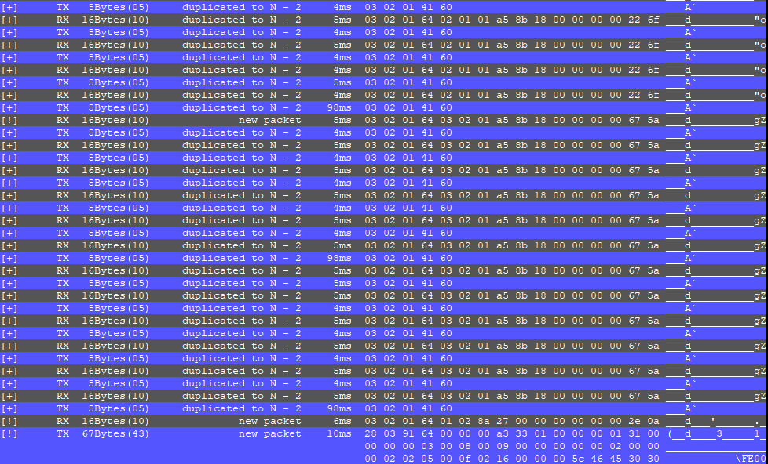

# ComSeeker



Purpose
---------------------------
Simple and super dirty python script for seeking unknown RS485 protocol. (for my usage)


Requirements
---------------------------
* Python 3
* pySerial
* HW Integrated UART device !! (not FT232)

Issue & fix soon
---------------------------
* There's no well-done interface for using. (currently 115200bps is default in internal function)
* useless code
* high CPU cycle consume (ARM-A53 10%(400% for 4 cores) consumption)
* Windows cannot show color on terminal.
* background color is decided by bash color table code.

Importatnt things for UART Device
---------------------------
Currently, CDM-USB device is not good for this script.
script judge time-gap under 1ms for slice packet.
But CDM-USB is not suitable for this behavior.
Recommned to use Rpi or Odroid or SBC that have 2 UART interface or more than 2 (exclude Linux debug UART interface)

How to use (fix this later after clean up code)
---------------------------

Connect your two RX pin to RO, DI.

Of course you should connect GND.

For Isolated situation, it's up to you.

```
    program = analyzer(duplicate_kill=30)
    program.add_monitor('/dev/ttyS1', nickname='TX', color='\033[104m')
    program.add_monitor('/dev/ttyS2', nickname='RX', color='\033[100m')
```
In def main()

fix first parameter to your UART device path.


Writer
---------------------------
### contacts : pmnxis@gmail.com
### License : MIT License